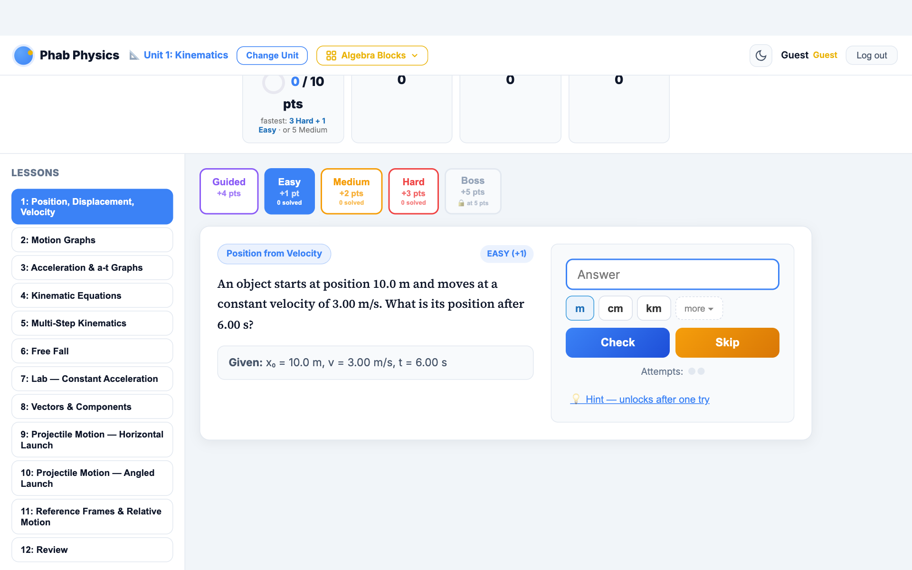
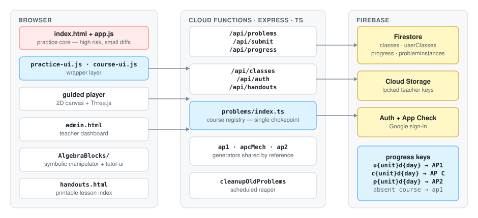
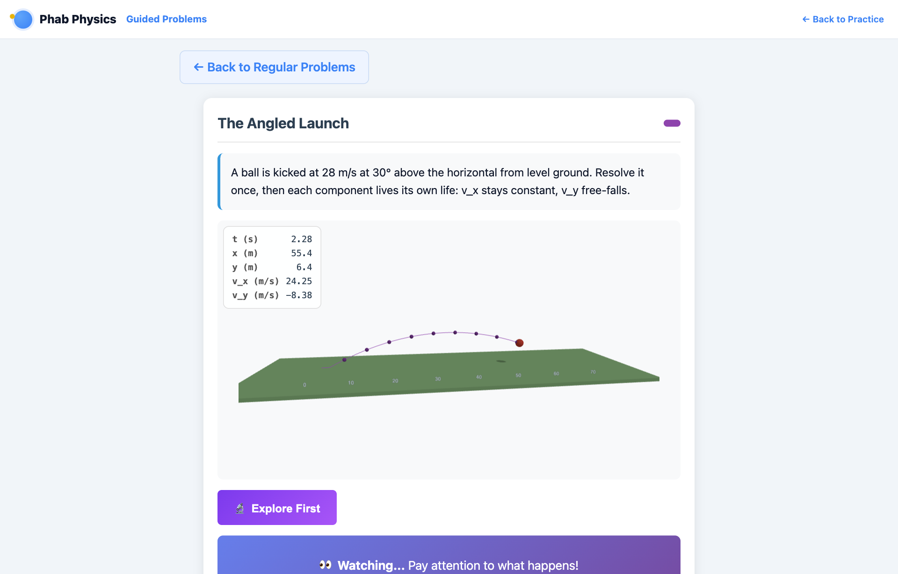
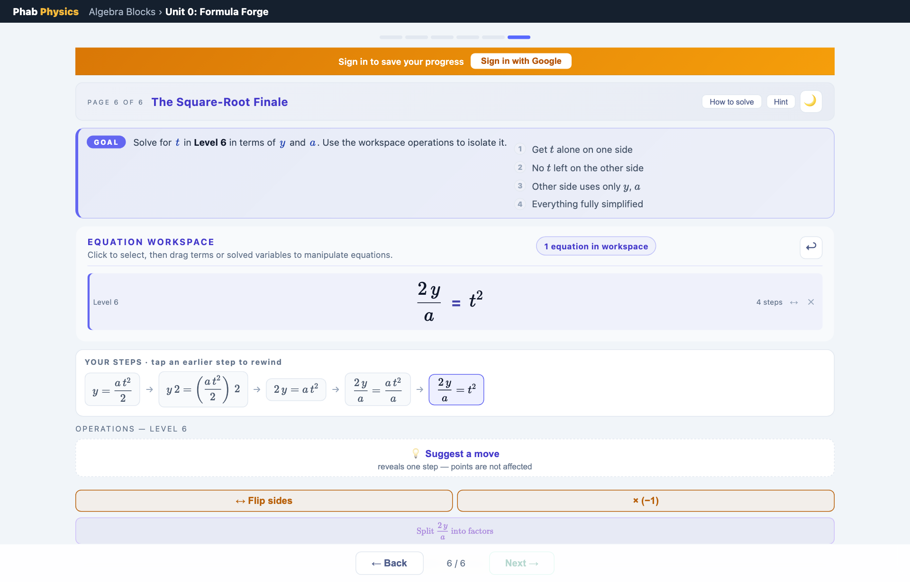

# PhabPhysics

PhabPhysics is a production practice and lesson platform for AP Physics 1,
AP Physics 2, and AP Physics C. It is used by students and teachers at
[phabphysics.com](https://phabphysics.com).

> The application source remains
> private because it is a live product connected to student and teacher data.

## System at a glance

| Area | Current scope |
|---|---|
| Courses | AP Physics 1 (Units 0–8), AP Physics 2 (Units 9–15), AP Physics C (Unit 0, Mechanics 1–7, E&M 8–13) |
| Practice registry | 306 course-days and 3,786 generator registrations (3,274 unique function references) |
| Practice modes | Four difficulty tiers, guided interactives, and a direct-manipulation algebra tool |
| Default generator sweep | 100 draws per registration, or 378,600 generated outputs |
| Verification | Two builds, 24 named check groups, browser render tests, and an emulator-backed end-to-end test |
| Stack | Vanilla HTML/CSS/JS, TypeScript, Express, Firebase, Puppeteer, and Three.js |

The generator counts above come from the current course registry. Some AP
Physics 1 and AP Physics C lessons share the same audited generator function by
reference, which is why both registrations and unique references are reported.

<picture>
  <source media="(prefers-color-scheme: dark)" srcset="img/architecture-dark.svg">
  
</picture>

More detail: [architecture](docs/architecture.md) and
[verification](docs/verification.md).

## Engineering decisions

### Test the generator, not one generated example

Each problem is produced at runtime, so a single fixture cannot represent the
possible output. The generator harness runs every registered function 100 times
and checks the returned object, student-facing text, optional diagrams and
graphs, answer magnitude, and client conversion. Failures identify the course,
unit, day, difficulty, generator index, and run number.

Those checks catch malformed output and implausible values; they do not prove
every physics derivation. Separate derivation tests and domain-specific
invariants cover selected calculations, while curriculum changes receive an
independent physics review.

An executable extraction of this approach is available in
[`verification-gates`](https://github.com/ahreinhardt/verification-gates). It
includes seeded property sweeps, reusable invariants, and snapshot baselines
with no runtime dependencies.

### Add courses without migrating existing progress

The backend resolves course content through one registry with three entries:
`ap1`, `apcMech`, and `ap2`. Progress keys include a course prefix:

| Prefix | Course |
|---|---|
| `u{unit}d{day}` | AP Physics 1 |
| `c{unit}d{day}` | AP Physics C |
| `p{unit}d{day}` | AP Physics 2 |

Older records have no course field. The server interprets a missing value as
AP Physics 1, so existing clients and progress documents continue to work. An
unrecognized value is rejected instead of silently selecting a course.

Where two courses use identical physics, AP Physics C imports the existing AP
Physics 1 generator function rather than copying it. Corrections therefore
apply to both courses from one source.

### Keep the scoring core change-minimized

`public/app.js` is a roughly 2,100-line global-state file that owns answer
checking and scoring. Practice and course features live in `practice-ui.js` and
`course-ui.js`, which load after the core. Algebra Blocks has a separate
`tutor-ui.js` module.

The initial course-selection change required one reviewed line in `app.js`: the
guest unit request was routed through the existing `apiCall` function so the
course wrapper could append a course value. Course selection, per-course guest
storage, progress-key mapping, and unit metadata remain in `course-ui.js`.

### Preserve stored identifiers

The internal id `apcMech` predates the Electricity & Magnetism expansion. It is
no longer a complete description of the course, but stored class settings and
progress records already reference it. Renaming it would require a migration
without changing the student experience, so the id stays and the interface
shows “AP Physics C.”

## Verification and CI

`npm run verify` builds the site and Cloud Functions, then runs 24 named check
groups. These cover registry wiring, LaTeX escaping, generator output, selected
independent derivations, energy invariants, and unit-specific content contracts.

Three GitHub Actions jobs run on pushes and pull requests:

| Job | Failure handling | Scope |
|---|---|---|
| `verify` | Fails the workflow | Both builds plus the fast verification chain |
| `browser` | Reported separately (`continue-on-error`) | Guided-problem render sweep, algebra tutor regression, and simulation checks |
| `e2e` | Fails the workflow | Critical classroom path against Firebase emulators |

The end-to-end test creates a teacher and student in the emulators, creates and
joins a class, renders an assigned lesson, submits one wrong and one correct
answer, checks the teacher dashboard, and verifies that the teacher can download
an answer key while the student is denied. It uses a Firebase demo project and
does not access production.

## LLM-assisted development

Curriculum drafts and a substantial share of the code were produced with LLM
assistance — Claude (Opus and Sonnet), GPT-5 via Codex, and Gemini. The project
log records the model used for each work session. I would rather state that
plainly than imply otherwise; the part worth describing is the structure that
makes it safe to do at this scale.

The governing rule is that the model which drafts a change does not approve it. A
different model re-derives the result from the stated givens, and is asked to find
a counterexample rather than to review it. The distinction is not cosmetic:
"check this" reliably produces agreement, while "find the error, and if you cannot,
say what you tried" produces something closer to evidence. Using a different model
family does real work here, because failure modes correlate within a family and
much less across them.

Every claimed defect carries a written verdict recording what was re-derived and
which refutation paths were tried and failed:

> CONFIRMED after adversarial re-derivation; every refutation path fails.
> Attempted refutations: "representation only shows in review" — false (it renders
> with the problem); "reading the ledger is the intended skill" — contradicted by
> the given text, the title, and the sibling convention.

Findings whose verification did not finish are recorded as pending rather than
promoted to confirmed.

That review is separate from the automated checks, and is not trusted like one.
Static checks handle repeatable conditions such as missing registrations, broken
math delimiters, answer leakage, and changed snapshots. Independent review handles
derivations, ambiguity, and pedagogy. I review scoring and curriculum changes
before release.

This process has caught incorrect numeric answer keys, a wrong isothermal curve on
a thermodynamics figure, student figures that displayed the result of the exercise
beside them, and mismatches between student materials and teacher keys. When a
failure turns out to be repeatable, I add a check for that class rather than
relying on review to catch it next time.

## Product views

| Guided problem with simulation telemetry |
|---|
|  |

| Algebra Blocks symbolic manipulator |
|---|
|  |

Algebra Blocks lets students rearrange equations by dragging terms, canceling
factors, and substituting between equations. It reports completion through the
same progress API as the practice system.

## Author

Alex Reinhardt is a physics teacher and software engineer with an MS in Software
Engineering from Rochester Institute of Technology. I designed the system,
review the physics curriculum, and operate the live service.
